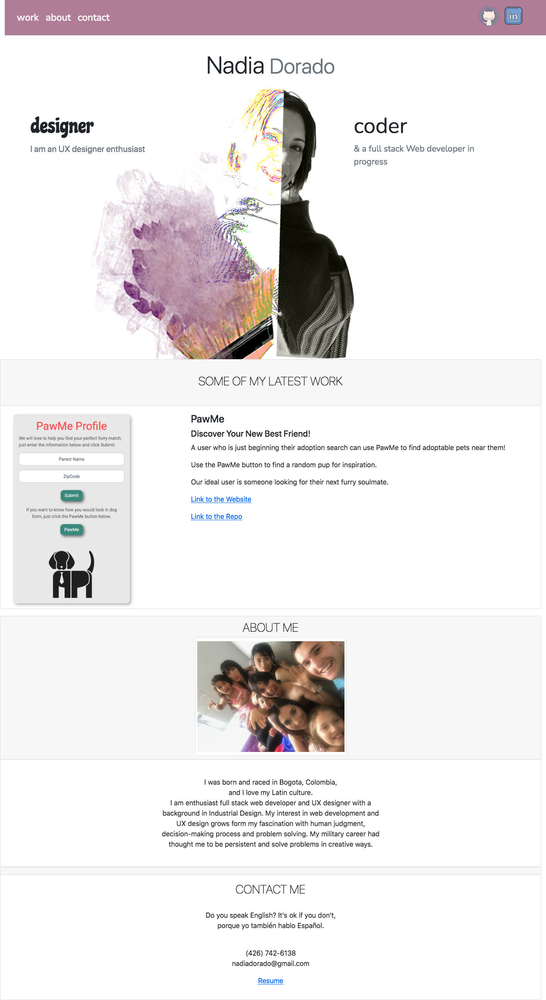

# My Porfolio: HW 02

This is a single page website where the user can find my most recent works, short bio and a way to contact me.

## Portfolio Webpage

The website is responsive to the screen changes Bootstarp 5.0

**Navagation Bar** 
Contains active links to their respective sections, as by clicking work, about and contact the page will take the user to that specific section. On the rigt side of the screen the icons for Github and LinkIn can be found. Also, the words turn lighter as a feed back to the user when they are hovering over.

**Work section** 
The PawMe project conatins a screenshot of the webpage, a description, a link to the website and the link to the repo. 

## Screenshot

The following image shows the web application's appearance:

## Link

Website's live link from GitHub (https://ndorado3.github.io/HW-02-My-Portfolio/)

## License

MIT

Copyright (c) [2021] [Nadia C.Dorado]

Permission is hereby granted, free of charge, to any person obtaining a copy
of this software and associated documentation files (the "Software"), to deal
in the Software without restriction, including without limitation the rights
to use, copy, modify, merge, publish, distribute, sublicense, and/or sell
copies of the Software, and to permit persons to whom the Software is
furnished to do so, subject to the following conditions:

The above copyright notice and this permission notice shall be included in all
copies or substantial portions of the Software.

THE SOFTWARE IS PROVIDED "AS IS", WITHOUT WARRANTY OF ANY KIND, EXPRESS OR
IMPLIED, INCLUDING BUT NOT LIMITED TO THE WARRANTIES OF MERCHANTABILITY,
FITNESS FOR A PARTICULAR PURPOSE AND NONINFRINGEMENT. IN NO EVENT SHALL THE
AUTHORS OR COPYRIGHT HOLDERS BE LIABLE FOR ANY CLAIM, DAMAGES OR OTHER
LIABILITY, WHETHER IN AN ACTION OF CONTRACT, TORT OR OTHERWISE, ARISING FROM,
OUT OF OR IN CONNECTION WITH THE SOFTWARE OR THE USE OR OTHER DEALINGS IN THE
SOFTWARE.
